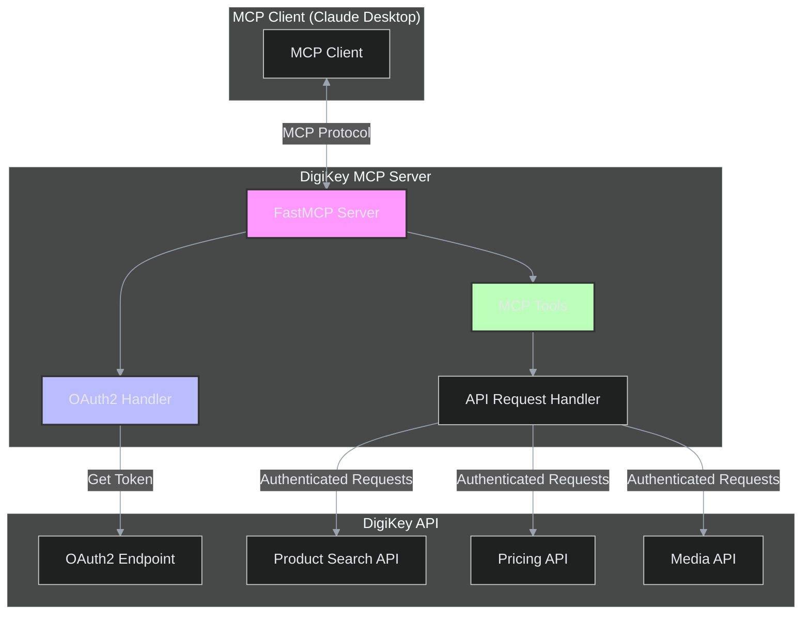
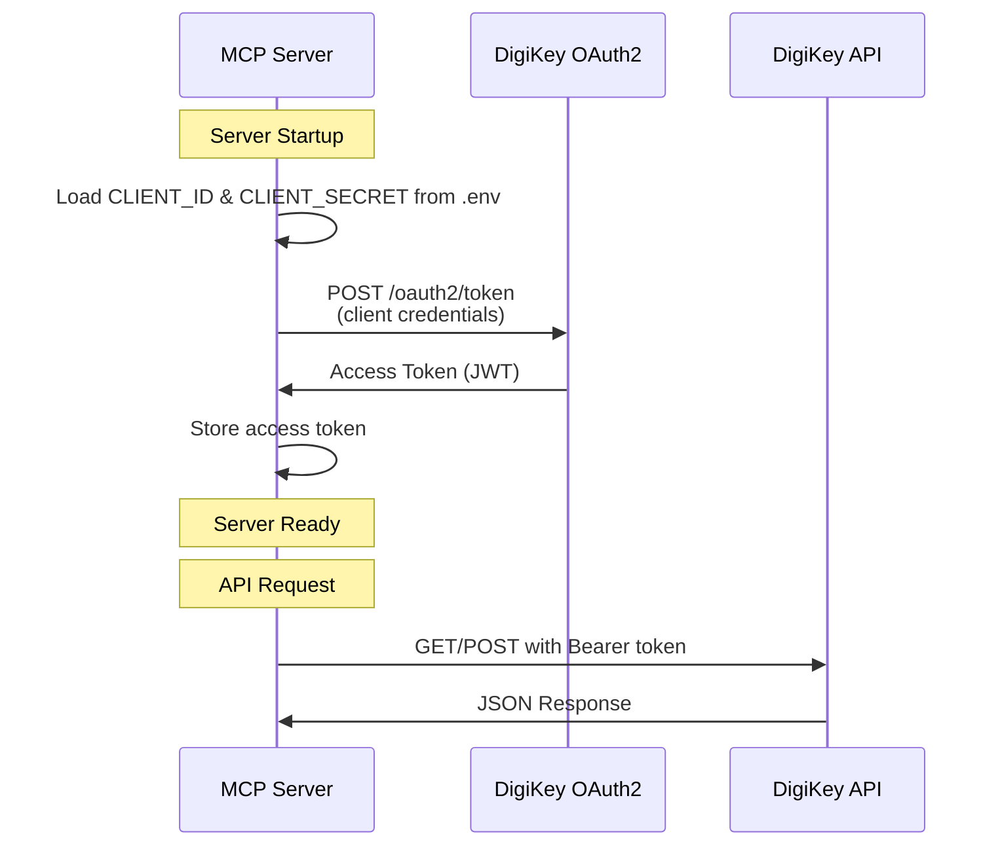
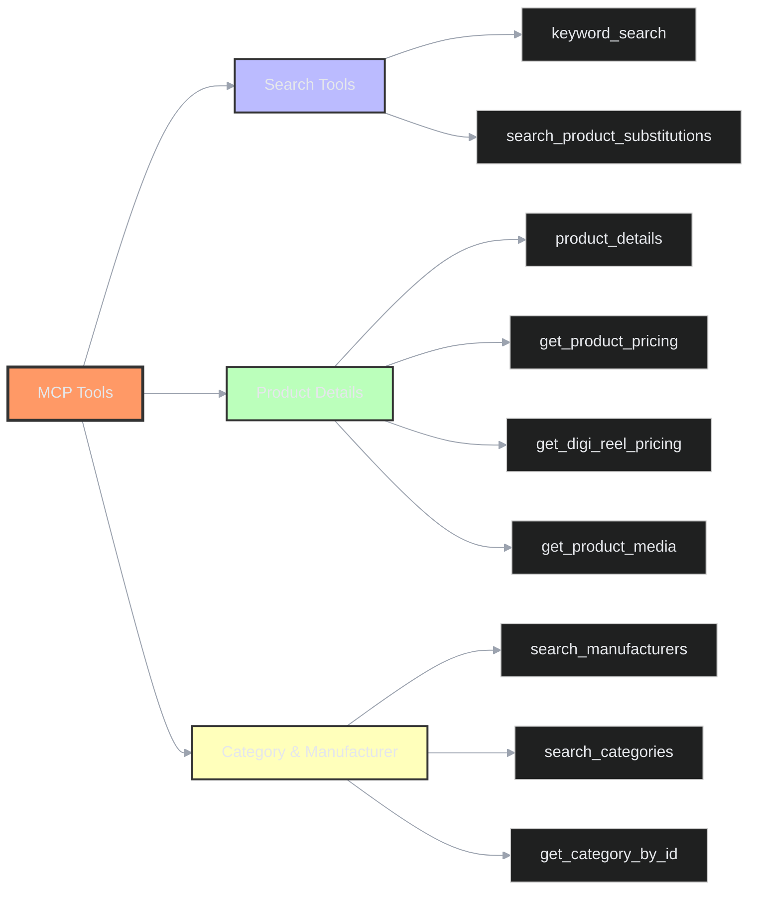
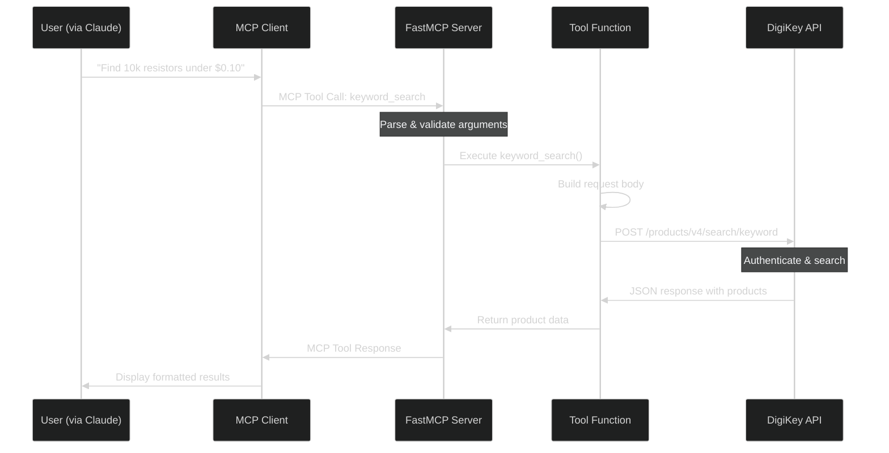
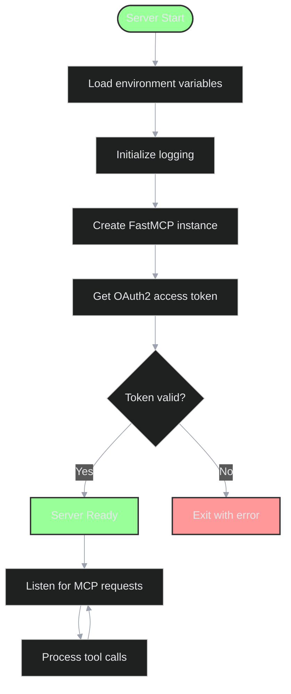

# DigiKey MCP Server - Code Breakdown

This document provides a detailed technical breakdown of the DigiKey MCP Server implementation, including architecture diagrams, code explanations, and integration details.

## Table of Contents

- [Architecture Overview](#architecture-overview)
- [Project Structure](#project-structure)
- [Authentication Flow](#authentication-flow)
- [Core Components](#core-components)
- [MCP Tools](#mcp-tools)
- [Dependencies](#dependencies)
- [Data Flow](#data-flow)
- [Error Handling](#error-handling)

---

## Architecture Overview

The DigiKey MCP Server is built using the Model Context Protocol (MCP), which allows AI assistants like Claude to interact with external services through a standardized interface.



### Key Components

1. **MCP Client**: Applications like Claude Desktop that communicate with the server
2. **FastMCP Server**: Python server implementing the MCP protocol
3. **OAuth2 Handler**: Manages authentication with DigiKey's API
4. **MCP Tools**: Python functions exposed as tools to the MCP client
5. **API Request Handler**: Makes HTTP requests to DigiKey's REST API

---

## Project Structure

```
digikey_mcp/
├── digikey_mcp_server.py    # Main server implementation
├── pyproject.toml            # Project dependencies and metadata
├── .env                      # Environment variables (not in repo)
├── .gitignore               # Git ignore patterns
├── README.md                 # User documentation
├── CODE_BREAKDOWN.md         # This file - technical documentation
├── uv.lock                   # Locked dependency versions
└── useful_llm_context/       # Reference documentation
    ├── fastMCP docs.txt      # FastMCP framework documentation
    └── digikey Product Search Swagger docs/  # DigiKey API specs
        └── ProductSearch*.json
```

### File Descriptions

- **digikey_mcp_server.py**: The core implementation containing all MCP tools, OAuth2 authentication, and API request logic
- **pyproject.toml**: Defines Python dependencies (fastmcp, requests, python-dotenv) and project metadata
- **.env**: Contains sensitive credentials (CLIENT_ID, CLIENT_SECRET, USE_SANDBOX)
- **useful_llm_context/**: Reference materials for understanding the DigiKey API and FastMCP framework

---

## Authentication Flow

The server uses OAuth2 Client Credentials flow to authenticate with DigiKey's API.



### Authentication Code Explanation

Located in `digikey_mcp_server.py:32-54`:

```python
def get_access_token():
    """Get OAuth2 access token from DigiKey."""
    if not CLIENT_ID or not CLIENT_SECRET:
        raise ValueError("CLIENT_ID and CLIENT_SECRET must be set in .env file")

    data = {
        "grant_type": "client_credentials",
        "client_id": CLIENT_ID,
        "client_secret": CLIENT_SECRET,
    }
    headers = {"Content-Type": "application/x-www-form-urlencoded"}

    resp = requests.post(TOKEN_URL, data=data, headers=headers)

    if resp.status_code != 200:
        logger.error(f"OAuth error: {resp.status_code} - {resp.text}")
        resp.raise_for_status()

    return resp.json()["access_token"]
```

**Key Points:**
- Uses **Client Credentials Grant** (machine-to-machine authentication)
- Token is obtained once at startup (line 58)
- Credentials are loaded from environment variables for security
- Token is reused for all subsequent API requests
- No refresh token mechanism (would need to restart server when token expires)

### Environment Configuration

The server supports two environments (configured in `digikey_mcp_server.py:22-27`):

| Environment | Use Case | Base URL |
|------------|----------|----------|
| Sandbox | Testing & development | `https://sandbox-api.digikey.com` |
| Production | Live product data | `https://api.digikey.com` |

Set `USE_SANDBOX=false` in `.env` to use the production API.

---

## Core Components

### 1. FastMCP Server Initialization

Located in `digikey_mcp_server.py:30`:

```python
mcp = FastMCP("DigiKey MCP Server")
```

This creates an MCP server instance. The FastMCP framework handles:
- MCP protocol communication (JSON-RPC over STDIO)
- Tool registration and schema generation
- Request/response serialization
- Integration with MCP clients

### 2. HTTP Request Headers

Located in `digikey_mcp_server.py:61-71`:

```python
def _get_headers(customer_id: str = "0"):
    """Get standard headers for DigiKey API requests."""
    return {
        "Authorization": f"Bearer {access_token}",
        "X-DIGIKEY-Client-Id": CLIENT_ID,
        "Content-Type": "application/json",
        "X-DIGIKEY-Locale-Site": "US",
        "X-DIGIKEY-Locale-Language": "en",
        "X-DIGIKEY-Locale-Currency": "USD",
        "X-DIGIKEY-Customer-Id": customer_id,
    }
```

**Header Purposes:**
- `Authorization`: Bearer token for OAuth2 authentication
- `X-DIGIKEY-Client-Id`: Identifies the application
- `X-DIGIKEY-Locale-*`: Sets region, language, and currency preferences
- `X-DIGIKEY-Customer-Id`: For customer-specific pricing (default "0" = public pricing)

### 3. Request Handler

Located in `digikey_mcp_server.py:73-90`:

```python
def _make_request(method: str, url: str, headers: dict, data: dict = None) -> dict:
    """Make an API request with error handling and logging."""
    logger.info(f"Making {method} request to {url}")

    if method.upper() == "GET":
        resp = requests.get(url, headers=headers)
    else:
        resp = requests.post(url, headers=headers, json=data)

    logger.info(f"Response status: {resp.status_code}")
    if resp.status_code != 200:
        logger.error(f"API error: {resp.status_code} - {resp.text}")
        resp.raise_for_status()

    return resp.json()
```

**Features:**
- Supports GET and POST methods
- Comprehensive logging for debugging
- Automatic error handling with exceptions
- Returns parsed JSON response

---

## MCP Tools

MCP tools are Python functions decorated with `@mcp.tool()` that become available to MCP clients. The FastMCP framework automatically:
- Generates JSON schemas from function signatures
- Validates arguments
- Serializes responses

### Tool Categories



### Search Tools

#### 1. keyword_search

**Location**: `digikey_mcp_server.py:92-127`

**Purpose**: Search for products using keywords with advanced filtering and sorting.

```python
@mcp.tool()
def keyword_search(
    keywords: str,
    limit: int = 5,
    manufacturer_id: str = None,
    category_id: str = None,
    search_options: str = None,
    sort_field: str = None,
    sort_order: str = "Ascending"
):
```

**Parameters:**
- `keywords`: Search terms (e.g., "resistor 10k", "STM32F4")
- `limit`: Number of results (default: 5)
- `manufacturer_id`: Filter by manufacturer
- `category_id`: Filter by product category
- `search_options`: Comma-separated filters (LeadFree, RoHSCompliant, InStock, etc.)
- `sort_field`: Field to sort by (Price, QuantityAvailable, Manufacturer, etc.)
- `sort_order`: Ascending or Descending

**API Endpoint**: `POST /products/v4/search/keyword`

**Example Request Body:**
```json
{
    "Keywords": "resistor 10k",
    "Limit": 5,
    "SearchOptionList": ["InStock", "RoHSCompliant"],
    "SortOptions": {
        "Field": "Price",
        "SortOrder": "Ascending"
    }
}
```

#### 2. search_product_substitutions

**Location**: `digikey_mcp_server.py:175-193`

**Purpose**: Find alternative/substitute products for a given part number.

**API Endpoint**: `GET /products/v4/search/{product_number}/substitutions`

**Use Case**: When a product is out of stock or discontinued, find compatible replacements.

### Product Detail Tools

#### 3. product_details

**Location**: `digikey_mcp_server.py:129-148`

**Purpose**: Get comprehensive information about a specific product.

**Returns:**
- Product specifications
- Manufacturer information
- Stock availability
- Pricing tiers
- Technical parameters
- Datasheets and documentation links

**API Endpoint**: `GET /products/v4/search/{product_number}/productdetails`

#### 4. get_product_pricing

**Location**: `digikey_mcp_server.py:206-221`

**Purpose**: Get detailed pricing information for specific quantities.

**Features:**
- Volume pricing tiers
- Customer-specific pricing
- Quantity break pricing

**API Endpoint**: `GET /products/v4/search/{product_number}/productpricing`

#### 5. get_digi_reel_pricing

**Location**: `digikey_mcp_server.py:223-238`

**Purpose**: Get pricing for DigiReel service (custom tape & reel quantities).

**DigiReel**: DigiKey's service for ordering surface-mount components on custom-sized reels instead of manufacturer standard packaging.

**API Endpoint**: `GET /products/v4/search/{product_number}/digireelpricing`

#### 6. get_product_media

**Location**: `digikey_mcp_server.py:195-204`

**Purpose**: Retrieve product images, documents, and videos.

**Returns:**
- Product photos (multiple angles)
- Datasheets (PDF links)
- 3D models (STEP, IGES files)
- Application notes
- Video demonstrations

**API Endpoint**: `GET /products/v4/search/{product_number}/media`

### Category & Manufacturer Tools

#### 7. search_manufacturers

**Location**: `digikey_mcp_server.py:150-155`

**Purpose**: Get a complete list of all manufacturers available on DigiKey.

**API Endpoint**: `GET /products/v4/search/manufacturers`

**Returns**: Array of manufacturer objects with:
- Manufacturer ID
- Manufacturer name
- Product count

#### 8. search_categories

**Location**: `digikey_mcp_server.py:157-162`

**Purpose**: Get the complete product category hierarchy.

**API Endpoint**: `GET /products/v4/search/categories`

**Returns**: Hierarchical category structure with subcategories.

#### 9. get_category_by_id

**Location**: `digikey_mcp_server.py:164-173`

**Purpose**: Get detailed information about a specific category.

**API Endpoint**: `GET /products/v4/search/categories/{category_id}`

---

## Data Flow

### Complete Request/Response Flow



### Example: keyword_search Flow

1. **User Request**: "Search for 10k resistors in stock"

2. **MCP Client** translates to tool call:
```json
{
    "tool": "keyword_search",
    "arguments": {
        "keywords": "resistor 10k",
        "search_options": "InStock",
        "limit": 10
    }
}
```

3. **FastMCP Server** validates and routes to `keyword_search()` function

4. **Tool Function** (digikey_mcp_server.py:105-127):
```python
url = f"{API_BASE}/products/v4/search/keyword"
headers = _get_headers()
body = {
    "Keywords": "resistor 10k",
    "Limit": 10,
    "SearchOptionList": ["InStock"]
}
return _make_request("POST", url, headers, body)
```

5. **API Request Handler** sends authenticated HTTP POST request

6. **DigiKey API** processes search and returns results

7. **Response** flows back through the chain to the user

---

## Error Handling

### Error Handling Strategy

The server implements error handling at multiple levels:

#### 1. OAuth Errors

Located in `digikey_mcp_server.py:49-51`:

```python
if resp.status_code != 200:
    logger.error(f"OAuth error: {resp.status_code} - {resp.text}")
    resp.raise_for_status()
```

**Common Issues:**
- Invalid credentials → Check `.env` file
- Network connectivity → Verify internet connection
- Wrong endpoint → Verify `USE_SANDBOX` setting

#### 2. Missing Credentials

Located in `digikey_mcp_server.py:35-36`:

```python
if not CLIENT_ID or not CLIENT_SECRET:
    raise ValueError("CLIENT_ID and CLIENT_SECRET must be set in .env file")
```

#### 3. API Request Errors

Located in `digikey_mcp_server.py:86-88`:

```python
if resp.status_code != 200:
    logger.error(f"API error: {resp.status_code} - {resp.text}")
    resp.raise_for_status()
```

**HTTP Status Codes:**
- `400`: Bad request (invalid parameters)
- `401`: Unauthorized (token expired/invalid)
- `404`: Product not found
- `429`: Rate limit exceeded
- `500`: DigiKey server error

#### 4. Logging

Comprehensive logging is configured at startup (digikey_mcp_server.py:9-13):

```python
logging.basicConfig(
    level=logging.INFO,
    format='%(asctime)s - %(name)s - %(levelname)s - %(message)s'
)
logger = logging.getLogger(__name__)
```

**Log Levels:**
- `INFO`: Normal operations, API calls
- `DEBUG`: Detailed request/response data
- `ERROR`: Failures and exceptions

---

## Dependencies

### Python Dependencies

Defined in `pyproject.toml:5-9`:

```toml
dependencies = [
    "fastmcp",
    "requests",
    "python-dotenv",
]
requires-python = ">=3.10"
```

### Dependency Details

#### 1. FastMCP

**Purpose**: MCP server framework
**Documentation**: [https://gofastmcp.com](https://gofastmcp.com)

**Key Features:**
- Automatic JSON schema generation from Python types
- Built-in STDIO transport for MCP communication
- Tool, resource, and prompt decorators
- Integration with Claude Desktop and other MCP clients

**Usage in Project:**
```python
from fastmcp import FastMCP
mcp = FastMCP("DigiKey MCP Server")

@mcp.tool()
def keyword_search(...):
    ...
```

**Key Documentation:**
- [Server Guide](https://gofastmcp.com/servers/server.md)
- [Tools Documentation](https://gofastmcp.com/servers/tools.md)
- [Claude Desktop Integration](https://gofastmcp.com/integrations/claude-desktop.md)

#### 2. Requests

**Purpose**: HTTP client library
**Documentation**: [https://requests.readthedocs.io](https://requests.readthedocs.io)

**Key Features:**
- Simple HTTP verb methods (GET, POST, etc.)
- Automatic JSON encoding/decoding
- Session management
- Authentication support

**Usage in Project:**
```python
import requests

# OAuth2 token request
resp = requests.post(TOKEN_URL, data=data, headers=headers)

# API requests
resp = requests.get(url, headers=headers)
resp = requests.post(url, headers=headers, json=data)
```

#### 3. Python-dotenv

**Purpose**: Environment variable management
**Documentation**: [https://pypi.org/project/python-dotenv/](https://pypi.org/project/python-dotenv/)

**Key Features:**
- Load environment variables from `.env` files
- Secure credential management
- Development/production configuration

**Usage in Project:**
```python
from dotenv import load_dotenv
import os

load_dotenv()
CLIENT_ID = os.getenv("CLIENT_ID")
CLIENT_SECRET = os.getenv("CLIENT_SECRET")
```

### External APIs

#### DigiKey Product Search API v4

**Documentation**: [https://developer.digikey.com/products/product-information/partsearch](https://developer.digikey.com/products/product-information/partsearch)

**Authentication**: OAuth2 Client Credentials
**Base URL**: `https://api.digikey.com` (or `https://sandbox-api.digikey.com`)

**Endpoints Used:**
| Endpoint | Method | Purpose |
|----------|--------|---------|
| `/v1/oauth2/token` | POST | Get access token |
| `/products/v4/search/keyword` | POST | Keyword search |
| `/products/v4/search/{pn}/productdetails` | GET | Product details |
| `/products/v4/search/manufacturers` | GET | List manufacturers |
| `/products/v4/search/categories` | GET | List categories |
| `/products/v4/search/categories/{id}` | GET | Category details |
| `/products/v4/search/{pn}/substitutions` | GET | Find substitutes |
| `/products/v4/search/{pn}/media` | GET | Product media |
| `/products/v4/search/{pn}/productpricing` | GET | Pricing info |
| `/products/v4/search/{pn}/digireelpricing` | GET | DigiReel pricing |

**Rate Limits**: Varies by API tier (check your DigiKey developer account)

**API Documentation Links:**
- [DigiKey Developer Portal](https://developer.digikey.com/)
- [API Authentication Guide](https://developer.digikey.com/documentation/oauth-2)
- [Product Search API Reference](https://developer.digikey.com/products/product-information/partsearch)

### Model Context Protocol (MCP)

**Documentation**: [https://modelcontextprotocol.io](https://modelcontextprotocol.io)

**Purpose**: Standardized protocol for connecting AI assistants to external tools and data sources

**Key Concepts:**
- **Tools**: Functions that can be called by the AI
- **Resources**: Data sources that can be read
- **Prompts**: Templates for common interactions
- **Transports**: Communication channels (STDIO, HTTP, SSE)

**Specification**: [MCP Specification](https://spec.modelcontextprotocol.io/)

---

## Advanced Topics

### Server Startup Sequence



### Extending the Server

To add a new tool:

1. Define a function with type hints:
```python
@mcp.tool()
def my_new_tool(param1: str, param2: int = 10) -> dict:
    """Tool description for LLM."""
    # Implementation
    return result
```

2. FastMCP automatically:
   - Generates JSON schema
   - Validates parameters
   - Exposes tool to MCP clients

3. Call DigiKey API if needed:
```python
url = f"{API_BASE}/some/endpoint"
headers = _get_headers()
return _make_request("GET", url, headers)
```

### Security Considerations

1. **Credential Storage**: Never commit `.env` file to version control
2. **Token Expiration**: Current implementation doesn't handle token refresh
3. **Rate Limiting**: DigiKey API has rate limits - implement caching if needed
4. **Input Validation**: FastMCP validates types, but consider additional validation
5. **Error Messages**: Avoid exposing sensitive information in error messages

### Performance Optimization

**Potential Improvements:**

1. **Token Caching**: Store token with expiration, refresh only when needed
2. **Response Caching**: Cache frequently accessed data (manufacturers, categories)
3. **Concurrent Requests**: Use `asyncio` for parallel API calls
4. **Connection Pooling**: Reuse HTTP connections with `requests.Session()`

### Testing

To test the server:

```bash
# Install test dependencies
uv sync

# Test OAuth2 authentication
uv run python -c "from digikey_mcp_server import get_access_token; print(get_access_token())"

# Test with FastMCP client
from fastmcp import FastMCP
# See FastMCP testing docs: https://gofastmcp.com/patterns/testing.md
```

---

## Troubleshooting

### Common Issues

| Issue | Cause | Solution |
|-------|-------|----------|
| "CLIENT_ID and CLIENT_SECRET must be set" | Missing `.env` file | Create `.env` with credentials |
| OAuth 401 Unauthorized | Invalid credentials | Verify CLIENT_ID and CLIENT_SECRET |
| OAuth 403 Forbidden | Wrong environment | Check `USE_SANDBOX` setting |
| API 404 Not Found | Invalid product number | Verify part number format |
| API 429 Rate Limited | Too many requests | Implement rate limiting/caching |
| No response from server | Server not running | Start server with `uv run python digikey_mcp_server.py` |

### Debug Mode

Enable debug logging:

```python
logging.basicConfig(level=logging.DEBUG)
```

This will show:
- Full request headers
- Request bodies
- Response data

---

## Additional Resources

### Official Documentation

- **FastMCP**: [https://gofastmcp.com](https://gofastmcp.com)
- **Model Context Protocol**: [https://modelcontextprotocol.io](https://modelcontextprotocol.io)
- **DigiKey API**: [https://developer.digikey.com](https://developer.digikey.com)
- **Python Requests**: [https://requests.readthedocs.io](https://requests.readthedocs.io)
- **Python-dotenv**: [https://pypi.org/project/python-dotenv/](https://pypi.org/project/python-dotenv/)

### Community & Support

- **FastMCP GitHub**: [https://github.com/jlowin/fastmcp](https://github.com/jlowin/fastmcp)
- **MCP Specification**: [https://spec.modelcontextprotocol.io](https://spec.modelcontextprotocol.io)
- **DigiKey Developer Support**: [https://forum.digikey.com](https://forum.digikey.com)

### Related Projects

- **MCP Servers**: [https://github.com/modelcontextprotocol/servers](https://github.com/modelcontextprotocol/servers)
- **Claude Desktop**: [https://claude.ai/download](https://claude.ai/download)

---

## Glossary

- **MCP**: Model Context Protocol - standardized way for AI to interact with tools
- **OAuth2**: Authentication protocol for API access
- **Bearer Token**: Access token passed in HTTP Authorization header
- **FastMCP**: Python framework for building MCP servers
- **Tool**: A function exposed through MCP that AI can call
- **DigiReel**: DigiKey's custom tape & reel service
- **Part Number**: Unique identifier for electronic components
- **RoHS**: Restriction of Hazardous Substances (environmental compliance)
- **STDIO**: Standard input/output (communication channel for MCP)

---

**Last Updated**: 2025-11-27
**Version**: 1.0
**Server Version**: 0.1.0
